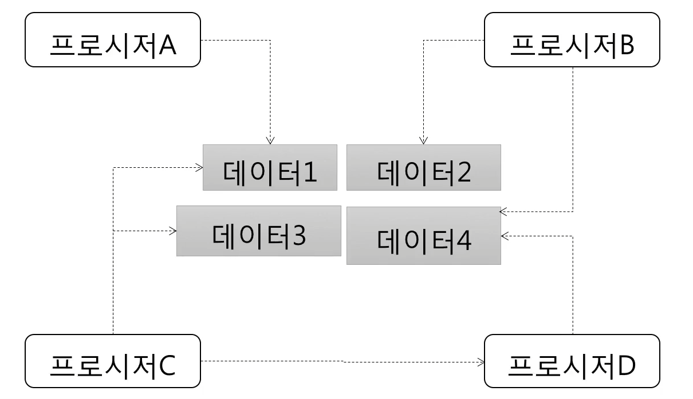
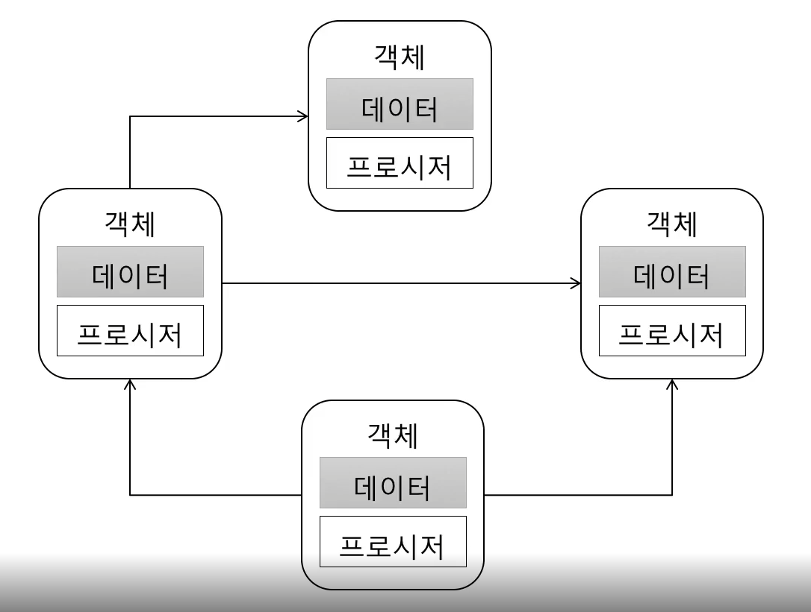

> [객체 지향 프로그래밍 입문](https://www.inflearn.com/course/%EA%B0%9D%EC%B2%B4-%EC%A7%80%ED%96%A5-%ED%94%84%EB%A1%9C%EA%B7%B8%EB%9E%98%EB%B0%8D-%EC%9E%85%EB%AC%B8)을 보고 정리한 자료입니다.

<br>

# 절차 지향 VS 객체 지향
<br>

## 절차지향

- 데이터를 여러프로시저가 공유하는 방식
- 위 그림처럼 데이터1을 프로시저A와 프로시저B가 공유하고 있다.
- 초기 러닝커브가 낮지만 데이터를 공유하는 방식(절차지향)은 구조를 복잡하게 만들고 수정이 어려워지는 단점이 있다.

### 절차 지향과 비용
```java
    //인증 API
    Account acoount  = findOne(id);
    if (account.getState() == DELETED) {

    }

    //암호 변경 API
    Account account = fineOne(id);
    if (account.getState() == DELETED) {

    }
```
- 인증API와 암호 변경 API에서 getState()를 사용하여 계정의 상태를 검사하고 있는데 BlockCount 0보다 큰 경우도 필터링 하라는 요구사항이 추가 되었다고 하자.

```java
        //인증 API
    Account acoount  = findOne(id);
    if (account.getState() == DELETED ||
        account.getBlockCount() > 0) {

    }

    //암호 변경 API
    Account account = fineOne(id);
    if (account.getState() == DELETED ||
        account.getBlockCount() > 0) {

    }
```
- 여기서 한번 더 인증시 이메일 인증이 필요하다는 요구사항과 암호 변경 API시 활성화된 계정만 필터를 통과하도록 하는 요구사항이 추가 되었다고 하면
```java
        //인증 API
    Account acoount  = findOne(id);
    if (account.getState() == DELETED ||
        account.getBlockCount() > 0 ||
        account.getEmailVerifyStatus() == 0) {

    }

    //암호 변경 API
    Account account = fineOne(id);
    if (account.getState() == DELETED ||
        account.getBlockCount() > 0 ||
        account.getActiveStatus() == ENABLE) {

    }
```
- 계속해서 요구사항이 추가될 때 마다 계속 추가해주어야 하고 추가된 조건들이 필요한 곳이 한 두군데가 아니기 때문에 코드를 찾고 수정할 때 비용이 많이 들게 된다.
<br>
## 객체지향

- 데이터와 프로시저를 객체라는 단위로 묶고 특정 객체의 프로시저만 접근 할 수 있도록 한다.
- 다른 객체에 직접적으로 접근 하지 못하게 한다.
- 객체는 데이터를 주고 받는게 아닌 프로시저를 호출한다.

## 객체
- 객체의 핵심 -> 기능 제공
    - 객체는 제공하는 기능으로 정의
        - 내부적으로 가진 필드(데이터)로 정의 하지 않는다.
    - 예: 회원 객체
        - 암호 변경하기 기능
        - 차단 여부 확인 하기 기능
    - 예: 소리 제어기
        - 소리 크기 증가 기능
        - 소리 크기 감소 기능

- 기능을 사용하기 위한 기능 명세를 작성해야 하는데 이를 메소드를 이용해서 기능을 명세한다.
    - 메소드는 이름, 파라미터, 결과로 구성되어 있음
```java
    public class VolumeController {
        public void increase(int inc) {

        }

        public void decrease(int dec) {

        }

        public int volume() {

        }
    }
```

- 객체와 객체는 기능을 사용해서 연결
    - 기능사용이란 메서드를 호출하는 것을 말한다.
```java
    public class Main {
        public static void main(String[] args) {
            VolumeController VolumnController = new VolumeController();
            
            VolumeController.increase(4);
            VolumeController.decrease(3);
            int currentVolume = VolumeController.volume();
        }
    }
```

- 객체와 객체가 상호작용하는 것을 <b>메시지</b>를 주고 받는다고 표현
    - 메서드 호출, 리턴, Exception발생 등, 메시지라고 표현한다.

<br>

### 한번 생각해 보기
```java
    public class Member {
        private String name;
        private String id;

        public void setName(String name) {
            this.name = name;
        }

        public String getName() {
            return name;
        }

        public void setId(String id) {
            this.id = id;
        }

        public String getId() {
            return id;
        }

    }
```
- name필드와 id필드에 직접 접근하는 것과 다름 없는 단순히 부가적인 기능이 없는 Class는 객체라고 표현하기보다 DataClass라고 표현한다.
- 여기에 기능들이 붙어야 객체라고 표현할 수 있다.